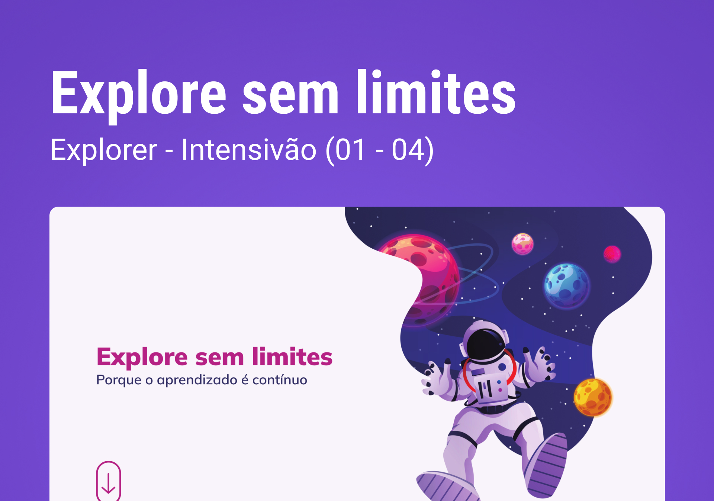

<h1 align="center"> Desafio - Explore sem limites </h1>

Este projeto é promovido pela Rocketseat para ensino de tecnologias WEB.  

  <a href="#-tecnologias">Tecnologias</a>&nbsp;&nbsp;&nbsp;|&nbsp;&nbsp;&nbsp;
  <a href="#-sobre-o-desafio">Sobre o desafio</a>&nbsp;&nbsp;&nbsp;&nbsp;&nbsp;&nbsp;

 

  

## 🚀 Tecnologias

Esse projeto foi desenvolvido com as seguintes tecnologias:

- HTML e CSS
- Git
- Figma

## 💻 Sobre o desafio

Chegou o momento de colocar a mão na massa e se desafiar com código!
Bora ver o que te espera por aí? 👀

Preparamos pra você um desafio que envolve o máximo de conteúdo visto nos stages iniciais.
Como dito anteriormente, passando pelo quiz e conseguindo reproduzir esse layout, sem grandes dificuldades, você já estará apto para **pular direto para o Stage 05**!
Woooow! Que demais, hein? 💙

A ideia aqui é você recriar esse **[layout](<https://www.figma.com/file/FWk4ZzVeK4pYzBT7qdJ5PA/Explore-sem-limites-(Copy)?type=design&node-id=158-678&t=dpLGFdDPHNPK8BtZ-0>)** mas, diferente dos desafios iniciais que possuem apenas uma tela, esse tem mais de uma seção…

- [Visite o projeto online]()
